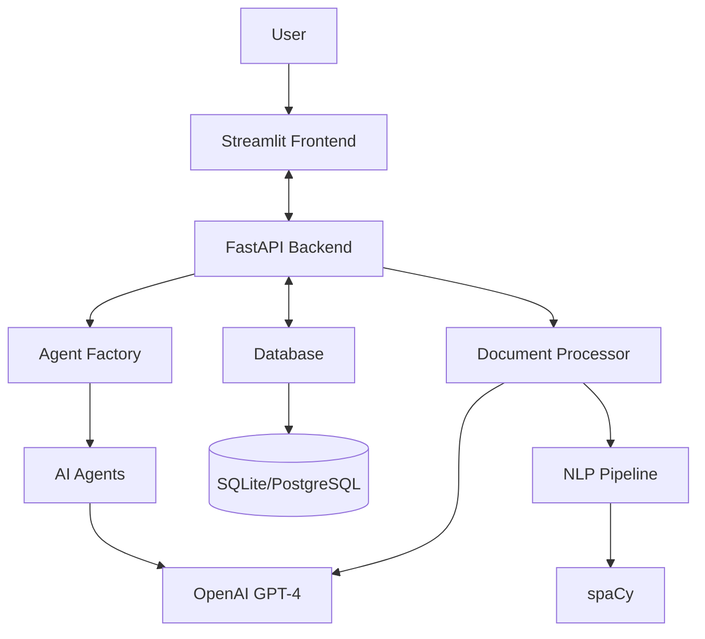
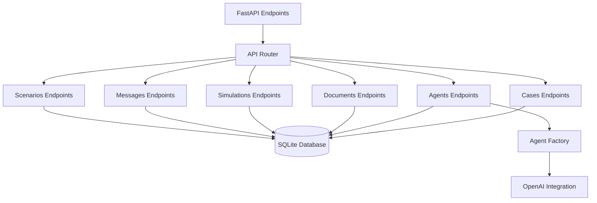
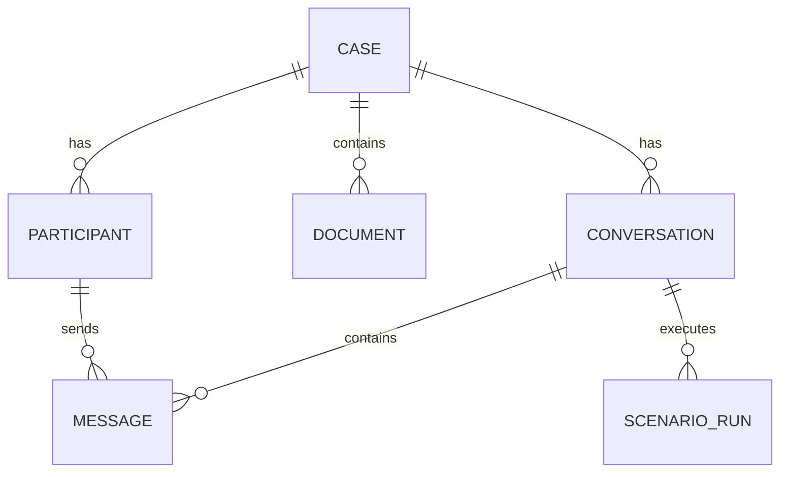

# Legal AI Virtual Courtroom ⚖️

[](https://www.python.org/downloads/)
[](https://fastapi.tiangolo.com/)
[](https://streamlit.io/)
[](https://openai.com/)
[](#)

A cutting-edge virtual courtroom simulation platform using AI agents to represent multiple legal roles, enabling interactive legal analysis, document processing, scenario simulation, and outcome prediction.

## 📋 Table of Contents

- [Features](#-features)
- [Tech Stack](#-tech-stack)
- [Getting Started](#-getting-started)
- [User Guide](#-user-guide)
- [System Architecture](#-system-architecture)
- [API Reference](#-api-reference)
- [Testing](#-testing)
- [Project Structure](#-project-structure)
- [Troubleshooting](#-troubleshooting)

## 🚀 Features

- **Multi-agent AI architecture** with five core specialized agents:
  - 👨‍💼 Client Agent (represents the user/client)
  - 👩‍💼 Opposing Party Agent (represents the opposing side)
  - ⚖️ Client's Legal Counsel Agent (represents your attorney)
  - 🧑‍⚖️ Opposing Counsel Agent (represents opposing counsel)
  - 👨‍⚖️ Judicial Agent (judge/mediator with legal knowledge)

- **Interactive Legal Proceedings**:
  - Direct examination and cross-examination simulations
  - Mock trial and hearing scenarios
  - Dynamic agent interactions with realistic legal reasoning
  - Memory systems for maintaining consistent case context

- **Document Processing**:
  - PDF document uploading and extraction
  - AI-powered legal analysis of documents
  - Multiple analysis types (standard, detailed, summary)
  - Key point extraction and relevance determination

- **Case Outcome Prediction**:
  - Sophisticated legal reasoning models
  - Confidence scoring and probability assessments
  - Factor-based analysis with evidence weighting
  - Detailed rationales and recommendations

## 💻 Tech Stack



- **Backend**: FastAPI with async support
- **Frontend**: Streamlit for rapid UI development
- **Database**: SQLAlchemy ORM with SQLite (dev) / PostgreSQL (prod)
- **AI**: OpenAI GPT-4 for all agents
- **Document Processing**: PyPDF2, spaCy
- **Testing**: Pytest

## 📋 Getting Started

### Prerequisites

- Python 3.8 or higher
- OpenAI API key

### Installation

1. Clone the repository:
   ```bash
   git clone https://github.com/yourusername/legal_ai.git
   cd legal_ai
   ```

2. Create a virtual environment:
   ```bash
   python -m venv venv
   ```

3. Activate the environment:
   - **Windows**: `venv\Scripts\activate`
   - **MacOS/Linux**: `source venv/bin/activate`

4. Install dependencies:
   ```bash
   pip install -r requirements.txt
   ```

5. Create a `.env` file in the project root with your OpenAI API key:
   ```
   OPENAI_API_KEY=your_api_key_here
   ```

### Running the Application

To start both the backend API and frontend simultaneously:

```bash
# Start both services
python run.py
```

Or run the services separately:

```bash
# Run backend only
source venv/bin/activate
uvicorn src.main:app --reload --port 8000

# Run frontend only (in a separate terminal)
source venv/bin/activate
streamlit run frontend/app.py
```

The services will be available at:
- Backend API: http://localhost:8000
- API Documentation (Swagger): http://localhost:8000/docs
- Frontend: http://localhost:8501

## 📘 User Guide

### Getting Started

1. **First-time setup**:
   - Start both the backend and frontend services as described above
   - The frontend will automatically connect to the backend on port 8000
   - Navigate to http://localhost:8501 in your web browser
   
2. **Navigation**:
   - Use the sidebar on the left for main navigation between features
   - The sidebar is organized into Case Management, Simulation Control, Document Management, and Analysis sections

### Case Management

1. **Creating a New Case**:
   - Click "Create New Case" in the sidebar
   - Fill in the required fields:
     - Case Title (e.g., "Smith v. Smith - Custody Dispute")
     - Case Type (e.g., "family", "civil", "criminal")
     - Description (detailed information about the case)
   - Click "Create Case" to save

2. **Selecting an Existing Case**:
   - Use the "Select Case" dropdown in the sidebar
   - Choose from the list of previously created cases
   - Click "View Case" to load the selected case

3. **Viewing Case Details**:
   - After selecting a case, the main panel will display case details
   - You can see the case title, type, description, and associated simulations

### Family Court Simulation

1. **Creating a Family Court Simulation**:
   - After selecting a case, click on "Create Simulation"
   - Enter a title for the simulation
   - Select "family_court" as the conversation type
   - Click "Create Simulation"

2. **Adding Participants**:
   - In the simulation view, click "Add Participants"
   - Fill in the details for the family court participants:
     - Client (name, background information)
     - Opposing Party (name, relationship to client)
     - Client's Legal Counsel (name, specialization)
     - Opposing Counsel (name, specialization)
     - Judge (name, jurisdiction)
   - Click "Add Participants" to save

### Document Management

1. **Uploading a Document**:
   - Click "Upload Document" in the sidebar
   - Select the associated case from the dropdown
   - Enter a title for the document
   - Select document type (e.g., "contract", "evidence", "testimony")
   - Click "Browse files" to select a document from your computer
   - Click "Upload" to submit

2. **Viewing Documents**:
   - Click "View Documents" in the sidebar
   - Select the case from the dropdown
   - Browse the list of uploaded documents
   - Click on a document title to view details

3. **Analyzing Documents**:
   - Click "Analyze Document" in the sidebar
   - Select the document to analyze
   - Choose analysis type (standard, detailed, or summary)
   - Click "Analyze" to process the document
   - Review the extracted key points and analysis

### Running Simulation Scenarios

1. **Creating a Scenario**:
   - In the simulation view, click "Run Scenario"
   - Enter a scenario description (e.g., "Initial custody hearing arguments")
   - Define a speaking order by selecting participants
   - Add context information if needed
   - Click "Run Scenario" to start

2. **Viewing Scenario Results**:
   - Once the scenario completes, messages will appear in the conversation panel
   - Each message shows the participant name, role, and content
   - Messages are organized chronologically

3. **Sending Individual Messages**:
   - In the simulation view, use the "Send Message" panel
   - Select the participant who will speak
   - Enter message content
   - Click "Send" to add to the conversation

### Predicting Case Outcomes

1. **Accessing the Prediction Tool**:
   - Click "Predict Outcome" in the sidebar
   - Select the case and simulation to analyze

2. **Setting Up the Prediction**:
   - Enter a detailed scenario description
   - Add key factors that influence the case:
     - Child Welfare
     - Financial Stability
     - Parenting History
     - Living Situation
   - For each factor, provide a description of how it applies
   - Add focus areas (e.g., "Procedural Issues", "Remedy Appropriateness")

3. **Getting the Prediction**:
   - Click "Predict Outcome"
   - Review the results:
     - Success likelihood percentage
     - Legal rationale
     - Key factors analysis
     - Strategic recommendations

## 🏛 System Architecture

### Backend Components



### Data Model



## 🔌 API Reference

Access the full interactive API documentation at http://localhost:8000/docs when the backend is running. Key endpoints include:

### Cases
- `GET /api/cases` - List all cases
- `GET /api/cases/{case_id}` - Get case details
- `POST /api/cases` - Create a new case

### Agents/Participants
- `GET /api/participants` - List all participants
- `POST /api/agents/family-court` - Create family court participants

### Simulations
- `GET /api/simulations` - List all simulations
- `GET /api/simulations/{simulation_id}` - Get simulation details
- `POST /api/simulations` - Create a new simulation
- `POST /api/simulations/{simulation_id}/scenario` - Run a simulation scenario
- `POST /api/simulations/{simulation_id}/predict` - Predict case outcome

### Documents
- `GET /api/documents` - List all documents
- `POST /api/documents/upload` - Upload a new document
- `POST /api/documents/{document_id}/analyze` - Analyze document

### Messages
- `GET /api/messages` - List all messages
- `GET /api/simulations/{simulation_id}/messages` - Get simulation messages
- `POST /api/messages` - Create a new message

## 🧪 Testing

### End-to-End Testing

Run the end-to-end test to verify that all components work together:

```bash
# Activate environment
source venv/bin/activate

# Run end-to-end test
python -m tests.test_end_to_end
```

This will simulate a complete workflow from case creation to outcome prediction, including:
1. Creating a case
2. Adding participants via the family court endpoint
3. Creating a simulation
4. Uploading and analyzing a document
5. Running a scenario with multiple participants
6. Generating an outcome prediction

### Validation Tests

A separate validation script is available to verify specific fixes and features:

```bash
python -m tests.validate_fixes
```

## 📁 Project Structure

```
legal_ai/
├── data/                  # Data storage directory
│   ├── db/                # Database files (SQLite)
│   └── documents/         # Uploaded user documents
├── docs/                  # Documentation
├── frontend/              # Streamlit frontend
│   ├── static/            # Static assets (CSS, images)
│   │   └── images/        # Image assets including logo
│   └── app.py             # Main Streamlit application
├── src/                   # Backend source code
│   ├── agents/            # AI agent implementations
│   │   ├── base.py        # Base agent class
│   │   ├── client.py      # Client agent
│   │   ├── factory.py     # Agent factory
│   │   ├── judicial.py    # Judge/mediator agent
│   │   ├── legal_counsel.py # Counsel agent
│   │   └── opposing_party.py # Opposing party agent
│   ├── api/               # API endpoints
│   │   ├── endpoints/     # Endpoint implementations
│   │   │   ├── agents.py  # Agent-related endpoints
│   │   │   ├── cases.py   # Case-related endpoints
│   │   │   ├── documents.py # Document-related endpoints
│   │   │   ├── messages.py  # Message-related endpoints
│   │   │   ├── scenarios.py # Scenario-related endpoints
│   │   │   └── simulations.py # Simulation-related endpoints
│   │   └── router.py      # Main API router
│   ├── database/          # Database models and connection
│   │   ├── connection.py  # Database connection setup
│   │   └── models.py      # SQLAlchemy models
│   ├── utils/             # Utility functions
│   │   └── logging_config.py # Logging configuration
│   └── main.py            # FastAPI main application
├── tests/                 # Test suite
│   ├── test_data/         # Test data files
│   ├── mock_agents.py     # Mock agent implementations
│   ├── test_end_to_end.py # End-to-end integration test
│   └── validate_fixes.py  # Validation test script
├── .env.example           # Example environment variables
├── .gitignore             # Git ignore file
├── requirements.txt       # Python dependencies
└── run.py                 # Application launcher script
```

## 🔧 Troubleshooting

### Common Issues

#### Backend Connection Errors

**Issue**: Frontend fails to connect to backend API

**Solution**:
1. Ensure the backend is running on port 8000
2. Check that the frontend is configured to use the correct API URL
3. Verify no firewall is blocking connections
4. If using a virtual environment, make sure it's activated

#### OpenAI API Issues

**Issue**: Agent creation or scenario execution fails with OpenAI errors

**Solution**:
1. Verify your OpenAI API key is correctly set in the .env file
2. Check API usage limits and billing status
3. Ensure you're using a supported model (GPT-4 recommended)
4. Add retry logic in case of rate limiting

#### Database Errors

**Issue**: Database-related errors when creating cases or simulations

**Solution**:
1. Check file permissions on the SQLite database file
2. Ensure the data/db directory exists and is writable
3. If the database schema has changed, consider recreating the database

#### Document Analysis Failures

**Issue**: Document analysis returning empty results or failing

**Solution**:
1. Verify the document format is supported (PDF recommended)
2. Check that the document content is extractable text, not scanned images
3. Try with a different document to isolate the issue

### Getting Help

If you encounter issues not covered here, please:

1. Check the logs in the terminal running the backend and frontend
2. Review the API documentation at http://localhost:8000/docs
3. Submit an issue with detailed reproduction steps and error messages
